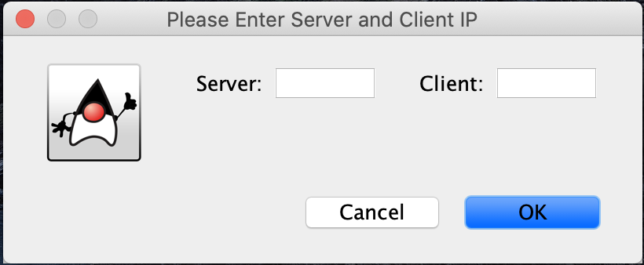
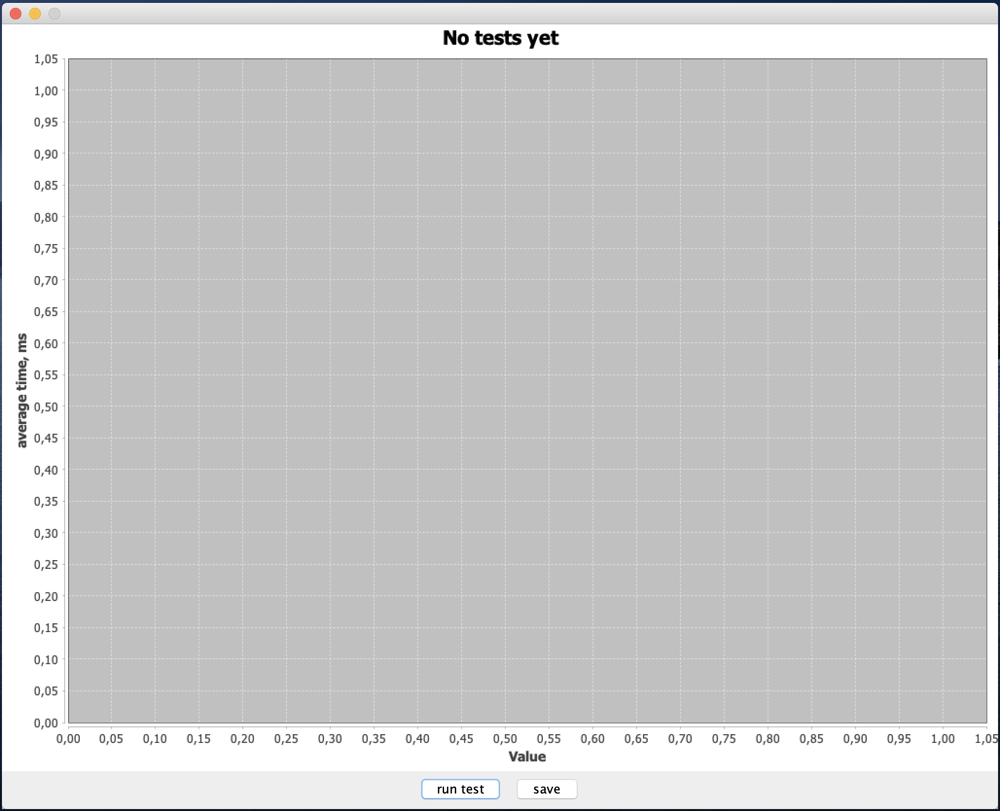
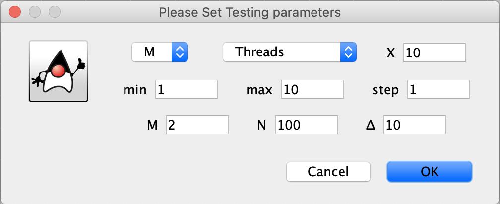
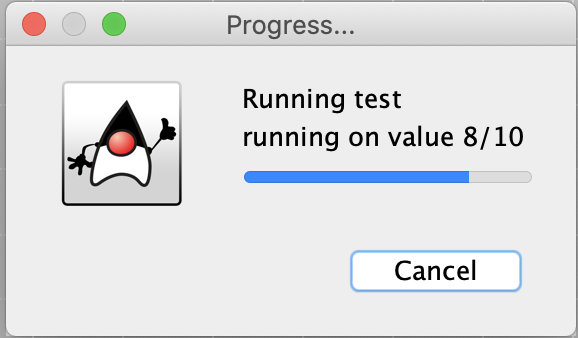

# Java Server Architecture tests

## Части приложения

Server - конслоьное приложение с раазличными архитектурами серверов
Client - конслоьное приложение имитирующее клиентов
GUI - графическое приложение через которое производиться тестирование

## Работа с приложением

Перед началм надо запустить серверную и клиентскую части приложения.

При запуске графического приложения необходимо указать адреса на которых запущены сервер и клиент.
Пустое поле адреса означает, что эта часть запущена там же где и графическое.

Далее появиться основное окно

Для начала теста можно нажать кнопку run test.
После этого появиться окно выбора параметров тестирования.

На нем можно выбрать архитекуру сервера, изменяемый параметр с его пределами и шагом, а так же остальные параметры.
После начала теста появиться окно с прогрессом, на котором также можно отменить тест если надоело ждать.

После на основном окне появиться график с результатами теста.
Кнопка save сохраняет результаты в выбранный файл.